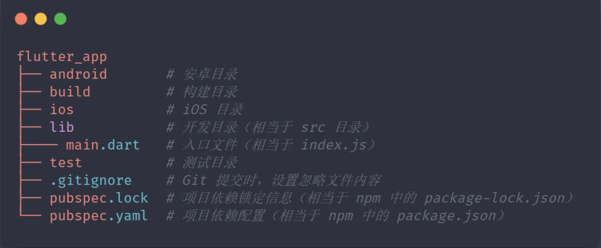
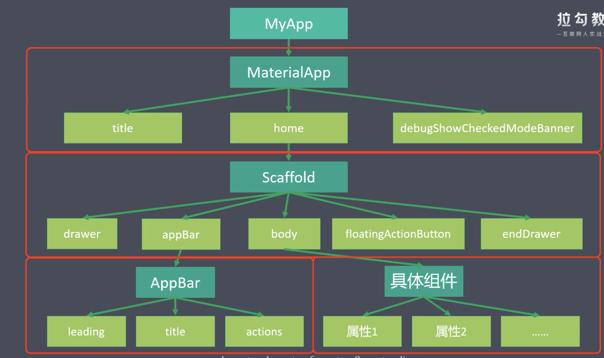
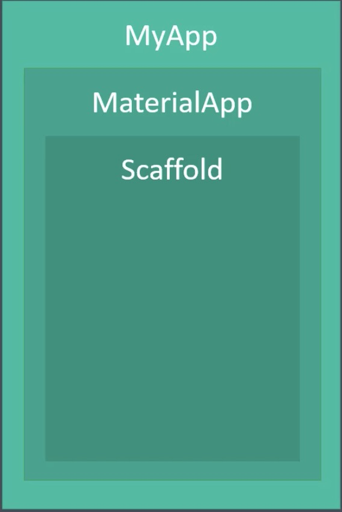
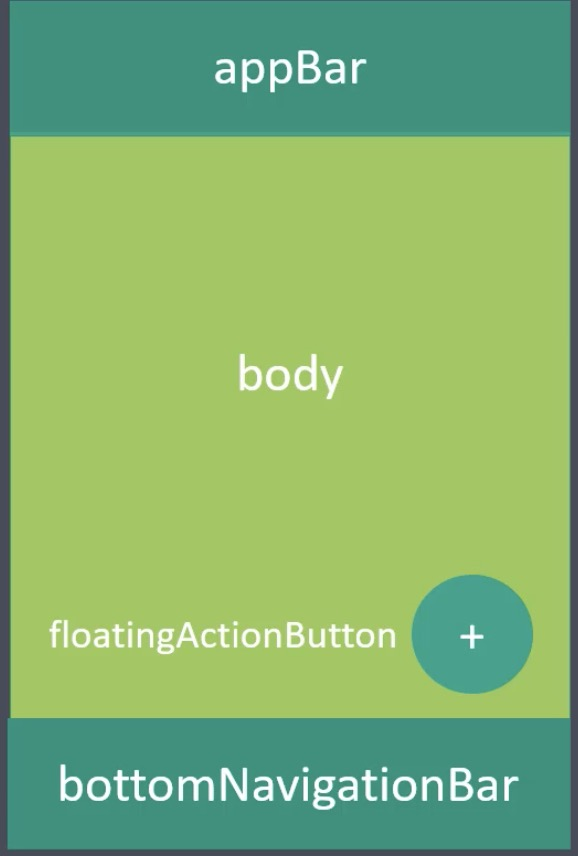
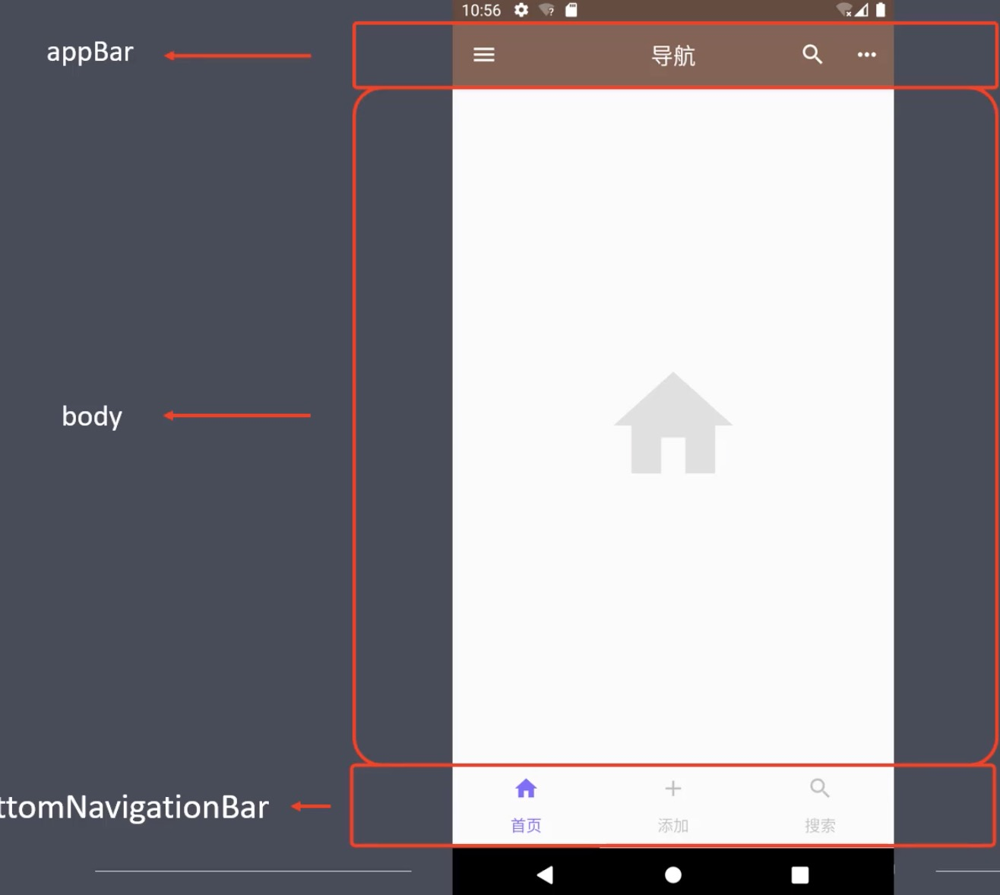

### Flutter
1. 组件库 Material Design (google 推出的UI组件库)
  * 官网 https://material.io
  * 中文官网 https://material-io.cn
  * 官网中文文档 https://www.mdui.org
2. flutter 中一切内容都是组件 (Widget)
  * 无状态组件 StatelessWidget
  * 有状态组件 StatefulWidget
3. 初始项目目录  

#### App 基础骨架
##### MaterialApp 组件
  - 是 Material Design 提供的基础组价，内部包含了 App 的基础骨架内容
  - title 在任务管理器中显示的标题
  - home 主内容
  - debugShowCheckedModeBanner 是否显示左上角的调试标记
##### Scaffold 
  - appBar 应用头部
  - body 应用主体
  - floatingActionButton 浮动按钮
  - drawer 左侧抽屉菜单
  - endDrawer 右侧抽屉菜单
  - app结构示意图 1
     
  - app结构示意图 2
       
    * Scaffold 结构
       
  - app 结构示意图3
     

### 基础组件
#### 常用
##### Text
  - TextDirection 文本方向
  - TextStyle 文本样式
    1. Colors 颜色
    2. FontWeight 字体粗细
    3. FontStyle 字体样式
  - TextAlign 对齐方式
  - TextOverflow 文本溢出
  - maxLines 最多显示几行
##### RichText 和 TextSpan 
  - 这俩个组件一般是组合使用
  - 作用是给一段文本添加不同的样式
  - 代码示例
    ```
      class TextDemo extends StatelessWidget {
        const TextDemo({super.key});

        @override
        Widget build(BuildContext context) {
          return Column(
            children: [
              const Text(
                'Flutter 帮助开发者通过一套代码库构建适用于移动、Web、桌面和嵌入式平台的精美应用。',
                textDirection: TextDirection.ltr,
                style: TextStyle(
                  fontSize: 30,
                  color: Colors.deepOrange,
                  fontWeight: FontWeight.w400,
                  fontStyle: FontStyle.italic,
                  decoration: TextDecoration.underline,
                  decorationColor: Colors.blueGrey,
                ),
                textAlign: TextAlign.center,
                maxLines: 2,
                overflow: TextOverflow.ellipsis,
                textScaler: TextScaler.linear(1.3),
              ),
              RichText(
                text: const TextSpan(
                    text: 'Hello',
                    style: TextStyle(
                      fontSize: 25,
                      color: Colors.lime,
                    ),
                    children: [
                      TextSpan(
                        text: 'Flutter',
                        style: TextStyle(
                          color: Colors.deepPurple,
                        ),
                      ),
                      TextSpan(
                          text: '你好世界',
                          style: TextStyle(
                            fontSize: 35,
                            color: Colors.redAccent,
                          ))
                    ]),
              ),
            ],
          );
        }
      }
    ```
##### 设置自定义字体
  - 下载字体文件
  - 在 pubspec.yaml 中声明字体
  - 示例
     
  - 使用
    1. 全局设置
      - MaterialApp 如下设置
        ```
          MaterialApp(
            ...,
            theme: ThemeData(fontFamily: 'AlimamaShuHeiTiBold'),
            ...
          );
        ```
    2. 为单个组件设置
      - 单个组件设置，例如在 Text 组件中，如下
        ```
          Text(
            ...,
            style: TextStyle(
              ...,
              fontFamily: 'AlimamaShuHeiTiBold',
            ),
            ...,
          )
        ```
##### Icon 字体图标组件
  - 使用 Icon(Icons.menu)
  - 在线预览地址1 https://www.mdui.org/design/style/icons.html#
  - 在线预览地址2 https://m3.material.io/styles/icons/overview
  - 说实话这俩个地址，我都看不懂
##### Color 
  - flutter 中通过 ARGB 来声明 ，js是 RGBA
  - const Color(0xFF42A5F5); 16进制的 ARGB ，其中 FF 标识透明度，42A5F5标识颜色值
  - const Color.fromARGB(0xFF, 0x42, 0xA5, 0xF5);
  - const color.fromARGB(255, 66, 165, 245);
  - const color.fromRGBO(66, 165, 245, 1.0); O标识透明度，这种方式更接近 js 中的 rgba(66, 165, 245, 1.0)
  - Colors.red 通过英文直接声明
##### Container
  - child 子元素
  - padding、margin 内边距外边距
    - 使用 EdgeInsets 组件实现，可以使用 EdgeInsets.all()、EdgeInsets.fromLTRB()、EdgeInsets.only()
  - docoration
    - 使用 BoxDecoration 组件实现，其中可以设置 边框、圆角、渐变、阴影、背景色、背景图片
  - alignment 
    - 使用 Alignment 组件实现 内容对齐
  - transform
    - 使用 Matrix 组件实现 translate rotate scale skew 

#### 布局
#### 按钮
#### 图片
#### 列表
#### 其他